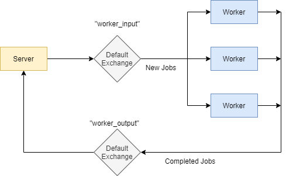

# RabbitMQ Worker Queue Pattern

Learning RabbitMQ. Implemented a worker queue pattern similar to [this tutorial](https://www.rabbitmq.com/tutorials/tutorial-two-go.html) which uses the default exchange to send tasks from 1 producer to 1 of many consumers. However, I added another queue for the workers to update the server when a jobs are finished.



## How to Run

1. Install Docker
2. Install Go 1.15

RabbitMQ
```bash
docker run -d --hostname my-rabbit --name some-rabbit -p 15672:15672 -p 5672:5672 rabbitmq:3-management
```

Go Server
```bash
cd server
go run .
```

Go Worker
```bash
cd worker
go run .
```

The server's endpoints are "/submit?name=foo" to submit a job and "/view" to see jobs 

## RabitMQ Resources

*Not created by me!* These are just my favourite resources I found when learning RabbitMQ

- [What Is RabbitMQ? (IBM)](https://www.youtube.com/watch?v=7rkeORD4jSw&ab_channel=IBMCloud)

- [RabbitMQ Official Tutorial](https://www.rabbitmq.com/tutorials/tutorial-one-python.html)

- [Go RabbitMQ Beginners Tutorial](https://www.youtube.com/watch?v=pAXp6o-zWS4)